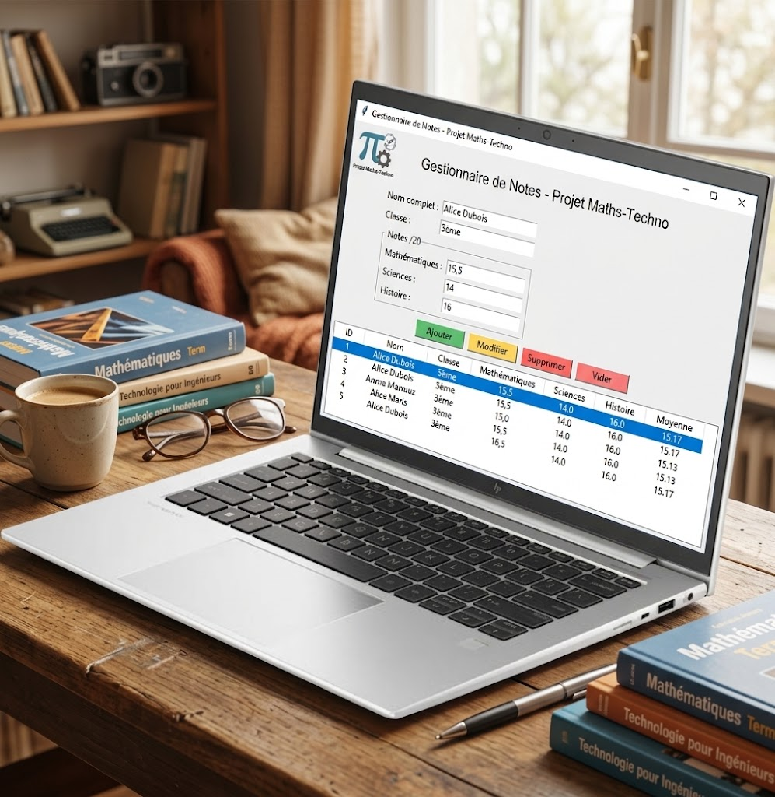

# Projet Maths-Techno

Application de bureau pour saisir les notes des eleves, calculer leur moyenne et les enregistrer dans un fichier Excel.



## Sommaire

- [Pourquoi cette application](#pourquoi-cette-application)
- [Fonctionnement](#fonctionnement)
- [Donnees enregistrees](#donnees-enregistrees)
- [Regles de saisie](#regles-de-saisie)
- [Fichier de donnees](#fichier-de-donnees)
- [Installation](#installation)
- [Structure du depot](#structure-du-depot)
- [Statut du projet](#statut-du-projet)
- [Contribuer](#contribuer)
- [Licence](#licence)

## Pourquoi cette application

Saisir les notes directement dans Excel expose a des erreurs : du texte a la place d'un nombre, une note hors limite, une formule effacee ou la mauvaise ligne modifiee. L'application sert d'intermediaire : elle verifie chaque donnee avant d'ecrire dans le fichier, qui reste la seule source de verite.

## Fonctionnement

La fenetre comporte un formulaire et un tableau :

- **Formulaire** : le nom (champ texte), la classe (liste : `CE6`, `1AC`, `2AC`, `3AC`, `TCS`, `1BAC`, `2BAC`), la lettre (liste : `A`, `B`, `C`) et les trois notes sur 20 (mathematiques, sciences, histoire). La virgule decimale est acceptee, par exemple `12,5`.
- **Boutons** : `Ajouter`, `Modifier`, `Supprimer` et `Vider` le formulaire.
- **Tableau** : la liste complete des eleves avec leur moyenne, rechargee depuis Excel.

Un clic sur une ligne recopie l'eleve dans le formulaire : il suffit de corriger puis de cliquer sur `Modifier`, ou de cliquer sur `Supprimer`.

L'eleve est stocke sous la forme `2BAC-B` (classe et lettre assemblees). L'interface n'est rafraichie qu'apres une sauvegarde reussie du fichier.

## Donnees enregistrees

Chaque eleve correspond a une ligne de la feuille `Notes` du classeur `data/notes.xlsx`.

| Colonne | Contenu |
| --- | --- |
| `ID` | numero unique attribue automatiquement a la creation |
| `Nom` | nom complet de l'eleve |
| `Classe` | classe et lettre de l'eleve, par exemple `2BAC-B` |
| `Mathematiques` | note sur 20 |
| `Sciences` | note sur 20 |
| `Histoire` | note sur 20 |
| `Moyenne` | moyenne simple, arrondie a deux decimales |

La moyenne est calculee ainsi :

```text
moyenne = (mathematiques + sciences + histoire) / 3
```

## Regles de saisie

Avant tout enregistrement, le programme verifie que :

- le nom n'est pas vide ;
- la classe et la lettre sont choisies dans les listes ;
- les trois notes sont renseignees et comprises entre 0 et 20 ;
- les decimaux avec virgule sont acceptes (`12,5`) ;
- l'eleve n'existe pas deja dans la meme classe (unicite `Nom + Classe`).

Si une donnee est incorrecte, un message designe le champ a corriger et rien n'est enregistre.

## Fichier de donnees

- Au premier lancement, l'application cree `data/notes.xlsx` avec l'entete.
- A chaque ajout, modification ou suppression : verification des donnees, calcul de la moyenne, ecriture dans Excel, rechargement du tableau.
- Si le fichier est ouvert dans Excel, introuvable ou illisible, l'application affiche une erreur claire et reste ouverte.

Ce fichier contient des donnees personnelles : il n'est jamais commite (voir `.gitignore`).

## Installation

Deux facons de lancer l'application.

### Versions compilees (Windows, macOS, Linux)

Des executables prets a l'emploi sont publies dans les [releases GitHub](https://github.com/iliasgws/Projet-Maths-Techno-GWS/releases) a chaque version (tag `v*`) : `Projet-Maths-Techno-windows.zip`, `Projet-Maths-Techno-macos.tar.gz` et `Projet-Maths-Techno-linux.tar.gz`. Ils ne demandent ni Python ni installation : extraire l'archive puis lancer l'executable.

Sur macOS, le premier lancement peut demander une autorisation (application non signee) : clic droit puis Ouvrir.

### Depuis les sources

Prerequis : Python 3.10 ou plus recent. Sur certaines distributions Linux, le paquet `python3-tk` doit etre installe separement.

```bash
git clone https://github.com/iliasgws/Projet-Maths-Techno-GWS.git
cd Projet-Maths-Techno-GWS
python -m pip install -r requirements.txt
python main.py
```

## Tests

Un test d'interface pilote par programme verifie les parcours principaux (validation, ajout, modification, suppression, synchronisation du tableau) sans cliquer :

```bash
python tests/test_gui.py
```

## Structure du depot

```text
Projet-Maths-Techno-GWS/
├── main.py                 # application complete (logique + interface)
├── tests/
│   └── test_gui.py         # test d'interface pilote par programme
├── requirements.txt        # openpyxl uniquement
├── assets/                 # icones de la fenetre
├── data/
│   └── notes.xlsx          # cree automatiquement, jamais commite
├── .github/workflows/      # CI, pages, release
├── CHANGELOG.md            # historique des versions
├── CONTRIBUTING.md         # guide de contribution
├── LICENSE                 # licence MIT
├── AGENTS.md               # consignes pour les agents (IA)
├── index.html              # page du site GitHub Pages
└── README.md
```

## Statut du projet

Le MVP est fonctionnel : saisie, validation, calcul de la moyenne, enregistrement Excel, modification et suppression. Les evolutions passees et a venir sont listees dans le [CHANGELOG](CHANGELOG.md).

## Contribuer

Les contributions sont bienvenues. Consultez le [guide de contribution](CONTRIBUTING.md) pour le workflow (branches, pull requests), le style des commits et les verifications a passer avant de pousser.

## Licence

Distribue sous [licence MIT](LICENSE).
