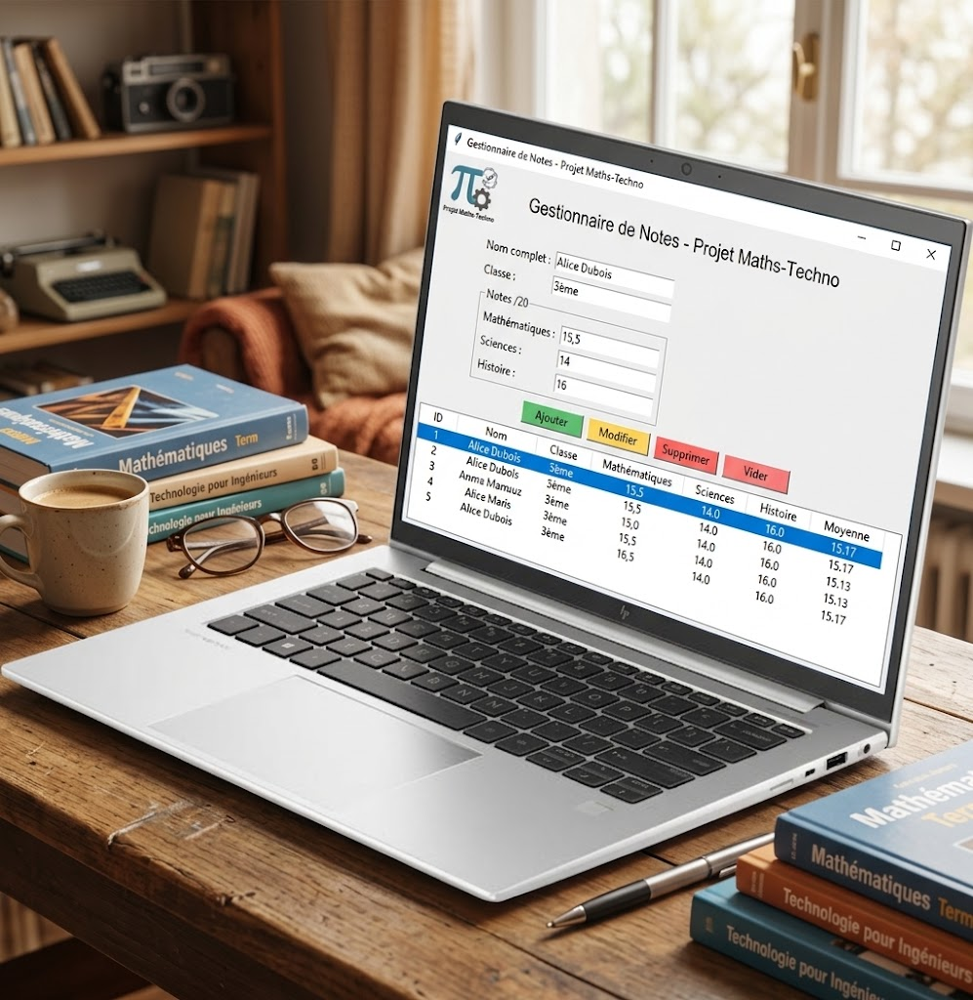

# Projet Maths-Techno



Une application de bureau pour saisir les notes des eleves, calculer leur moyenne et tout enregistrer dans un fichier Excel. Elle fonctionne hors ligne, sur votre ordinateur, sans compte a creer et sans connexion internet.

## Demarrage rapide

1. Sur la page [releases](https://github.com/iliasgws/Projet-Maths-Techno-GWS/releases), telechargez l'archive correspondant a votre systeme : `Projet-Maths-Techno-windows.zip`, `Projet-Maths-Techno-macos.tar.gz` ou `Projet-Maths-Techno-linux.tar.gz`.
2. Extrayez l'archive, puis lancez le fichier `Projet-Maths-Techno` (`.exe` sur Windows) en double-cliquant dessus.
3. La fenetre de l'application s'ouvre. Au premier lancement, le fichier de notes est cree automatiquement : remplissez le formulaire d'un eleve et cliquez sur `Ajouter`.

C'est tout. Python n'est necessaire que si vous souhaitez lancer le code vous-meme (voir [Lancer depuis les sources](#lancer-depuis-les-sources)).

## Sommaire

- [Demarrage rapide](#demarrage-rapide)
- [A quoi sert l'application](#a-quoi-sert-lapplication)
- [Installer l'application](#installer-lapplication)
- [Premiers pas](#premiers-pas)
- [Utiliser l'application](#utiliser-lapplication)
- [Regles de saisie](#regles-de-saisie)
- [Ou sont mes notes](#ou-sont-mes-notes)
- [En cas de probleme](#en-cas-de-probleme)
- [Pour les contributeurs](#pour-les-contributeurs)
- [Licence](#licence)

## A quoi sert l'application

Saisir les notes directement dans Excel comporte des risques : une lettre a la place d'un nombre, une note sur 25 au lieu de 20, la mauvaise ligne modifiee, une formule effacee par megarde. Cette application sert d'intermediaire :

- elle refuse les donnees impossibles avant d'ecrire quoi que ce soit ;
- elle calcule la moyenne toute seule ;
- elle ecrit dans le meme fichier Excel, que vous pouvez ensuite ouvrir et utiliser comme d'habitude.

Le fichier Excel reste la seule source de verite. Vous pouvez l'ouvrir a tout moment, et l'application recharge les eleves a chaque lancement.

## Installer l'application

### Version prete a l'emploi (Windows, macOS, Linux)

Des versions compilees sont publiees dans les [releases GitHub](https://github.com/iliasgws/Projet-Maths-Techno-GWS/releases) a chaque version (identifiee par un tag `v*`) :

| Systeme | Fichier a telecharger |
| --- | --- |
| Windows | `Projet-Maths-Techno-windows.zip` |
| macOS | `Projet-Maths-Techno-macos.tar.gz` |
| Linux | `Projet-Maths-Techno-linux.tar.gz |

Il n'y a rien a installer : extrayez l'archive puis lancez le fichier `Projet-Maths-Techno`.

Sur macOS, la premiere ouverture demande une confirmation car l'application n'est pas signee : clic droit sur le fichier, puis `Ouvrir`.

### Lancer depuis les sources

Si vous avez Python 3.10 ou une version plus recente, et que vous voulez lancer le code du depot :

```bash
git clone https://github.com/iliasgws/Projet-Maths-Techno-GWS.git
cd Projet-Maths-Techno-GWS
python -m pip install -r requirements.txt
python main.py
```

Sur certaines distributions Linux, le module d'interface doit etre installe separement :

```bash
sudo apt install python3-tk
```

## Premiers pas

1. Lancez l'application.
2. Au premier lancement, le fichier `data/notes.xlsx` est cree tout seul, avec ses colonnes. Il n'y a rien a preparer.
3. Dans le cadre `Eleve`, remplissez :
   - `Nom` : le nom complet de l'eleve, par exemple `Alice Martin` ;
   - `Classe` : choisissez-la dans la liste (`CE6`, `1AC`, `2AC`, `3AC`, `TCS`, `1BAC`, `2BAC`) ;
   - `Lettre` : choisissez-la dans la liste (`A`, `B` ou `C`) ;
   - `Mathematiques (sur 20)`, `Sciences (sur 20)` et `Histoire (sur 20)` : les trois notes.
4. Cliquez sur `Ajouter`. L'eleve apparait dans le tableau avec sa moyenne.

Pour demarrer une nouvelle saisie, cliquez sur `Vider` : le formulaire se vide et la ligne selectionnee dans le tableau est deselectionnee.

## Utiliser l'application

La fenetre comporte un formulaire (`Eleve`) et un tableau (`Eleves`) qui liste tous les eleves enregistres.

| Bouton | Quand l'utiliser |
| --- | --- |
| `Ajouter` | Enregistrer l'eleve saisi dans le formulaire. |
| `Modifier` | Enregistrer les corrections sur l'eleve selectionne dans le tableau. |
| `Supprimer` | Retirer l'eleve selectionne du fichier. Une confirmation est demandee. |
| `Vider` | Vider le formulaire et deselectionner la ligne du tableau. |

**Corriger une note ou un nom** : cliquez sur la ligne de l'eleve dans le tableau, elle est recopiee dans le formulaire. Corrigez les valeurs, puis cliquez sur `Modifier`.

**Supprimer un eleve** : cliquez sur sa ligne dans le tableau, puis sur `Supprimer` et confirmez.

Le tableau est rafraichi uniquement apres une sauvegarde reussie du fichier : si un message d'erreur s'affiche, rien n'a ete enregistre. Pour `Modifier` et `Supprimer`, il faut d'abord selectionner une ligne, sinon l'application le signale.

L'eleve est enregistre sous la forme `2BAC-B` : la classe et la lettre assemblees.

## Regles de saisie

Avant chaque enregistrement, l'application verifie que :

- le nom n'est pas vide (`Le nom est vide.`) ;
- la classe et la lettre sont choisies dans les listes (`La classe n'est pas choisie.`) ;
- les trois notes sont renseignees et comprises entre 0 et 20. Les decimaux sont acceptes, avec la virgule ou le point : `12,5` ou `12.5` ;
- le meme nom n'existe pas deja dans la meme classe, lettre comprise (`Alice Martin existe deja dans la classe 2BAC-B.`). Deux eleves peuvent donc porter le meme nom, mais pas dans la meme classe.

Si une donnee est incorrecte, un message indique le champ a corriger et rien n'est enregistre.

## Ou sont mes notes

Toutes les notes sont reunies dans un seul fichier : `data/notes.xlsx`, dans le dossier `data/` situe a cote de l'application, sur la feuille `Notes`.

| Colonne | Contenu |
| --- | --- |
| `ID` | numero unique attribue automatiquement a la creation |
| `Nom` | nom complet de l'eleve |
| `Classe` | classe et lettre de l'eleve, par exemple `2BAC-B` |
| `Mathematiques` | note sur 20 |
| `Sciences` | note sur 20 |
| `Histoire` | note sur 20 |
| `Moyenne` | moyenne simple, arrondie a deux decimales |

La moyenne est calculee ainsi :

```text
moyenne = (mathematiques + sciences + histoire) / 3
```

Elle est recalculee a chaque enregistrement, donc toujours a jour. Vous pouvez ouvrir ce fichier dans Excel, le copier, le sauvegarder ou l'envoyer a un collegue. En revanche, fermez-le dans Excel avant d'enregistrer dans l'application, sinon celle-ci ne peut pas ecrire dedans (voir [En cas de probleme](#en-cas-de-probleme)).

Ce fichier contient des donnees personnelles (noms et notes d'eleves) : il n'est jamais partage dans le depot (voir `.gitignore`). A vous de le sauvegarder si vous le souhaitez.

## En cas de probleme

| Message ou symptome | Comment reagir |
| --- | --- |
| `Fermez le fichier dans Excel puis reessayez.` | `data/notes.xlsx` est ouvert dans Excel ou un autre programme, qui bloque l'ecriture. Fermez-le (une fenetre Excel masquee compte aussi), puis recommencez votre action. |
| Le fichier `notes.xlsx` n'apparait pas dans le dossier `data/`. | Il est cree au premier lancement, a cote de l'application. Placez celle-ci dans un dossier classique, par exemple `Documents`, et non a la racine du disque. |
| macOS : l'application ne s'ouvre pas car le developpeur ne peut pas etre verifie. | Clic droit sur le fichier `Projet-Maths-Techno`, puis `Ouvrir`, puis `Ouvrir` dans la fenetre qui s'affiche. Cette confirmation n'est demandee qu'une fois. |
| Linux : le fichier telecharge ne se lance pas au double-clic. | Ouvrez un terminal dans le dossier de l'archive, puis lancez `./Projet-Maths-Techno`. |
| Linux, depuis les sources : `ModuleNotFoundError: No module named 'tkinter'`. | Installez le paquet du systeme : `sudo apt install python3-tk`. |
| Depuis les sources : `python: command not found`, ou version trop ancienne. | Installez Python 3.10 ou plus recent, puis relancez `python -m pip install -r requirements.txt`. |
| `La note 25 n'est pas comprise entre 0 et 20`. | Les notes de l'application vont de 0 a 20. Si vous utilisez une autre bareme, convertissez-la avant la saisie. |
| `Alice Martin existe deja dans la classe 2BAC-B.` | L'eleve est deja enregistre dans cette classe. Pour un homonyme dans une autre classe, changez la lettre ; dans la meme classe, distinguez les deux eleves par leur prenom. |
| Rien ne se passe apres avoir clique sur `Modifier` ou `Supprimer`. | Aucune ligne du tableau n'est selectionnee : cliquez d'abord sur la ligne de l'eleve. |
| L'eleve que je viens de corriger n'apparait pas dans le tableau. | Une erreur est probablement affichee et rien n'a ete enregistre : lisez le message, corrigez le champ indique, puis cliquez a nouveau sur `Modifier`. |

## Pour les contributeurs

### Statut du projet

Le MVP est fonctionnel : saisie, validation, calcul de la moyenne, enregistrement Excel, modification et suppression. Les evolutions passees et a venir sont listees dans le [CHANGELOG](CHANGELOG.md).

### Structure du depot

```text
Projet-Maths-Techno-GWS/
├── main.py                 # application complete (logique + interface)
├── tests/
│   └── test_gui.py         # test d'interface pilote par programme
├── requirements.txt        # openpyxl uniquement
├── assets/                 # icones de la fenetre
├── data/
│   └── notes.xlsx          # cree automatiquement, jamais commite
├── .github/workflows/      # CI, pages, release
├── CHANGELOG.md            # historique des versions
├── CONTRIBUTING.md         # guide de contribution
├── LICENSE                 # licence MIT
├── AGENTS.md               # consignes pour les agents (IA)
├── index.html              # page du site GitHub Pages
└── README.md
```

### Tests

Un test d'interface pilote par programme verifie les parcours principaux (validation, ajout, modification, suppression, synchronisation du tableau) sans cliquer :

```bash
python tests/test_gui.py
```

### Contribuer

Les contributions sont bienvenues. Consultez le [guide de contribution](CONTRIBUTING.md) pour le workflow (branches, pull requests), le style des commits et les verifications a passer avant de pousser.

## Licence

Distribue sous [licence MIT](LICENSE). Le code, les images et cette documentation ont ete produits avec l'aide d'une intelligence artificielle.
